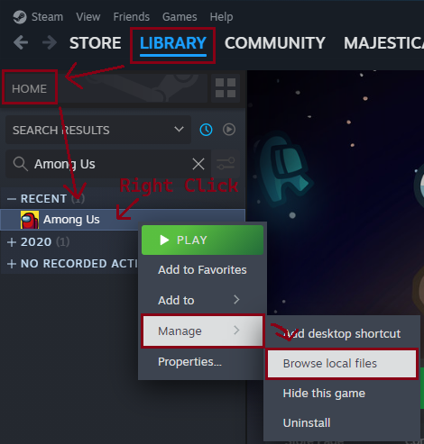
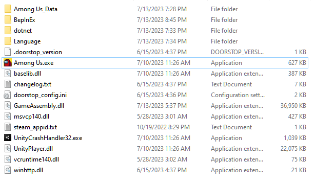
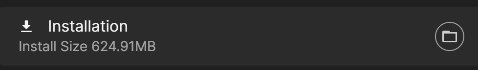
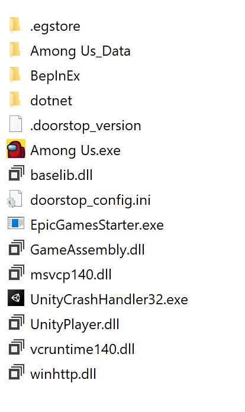
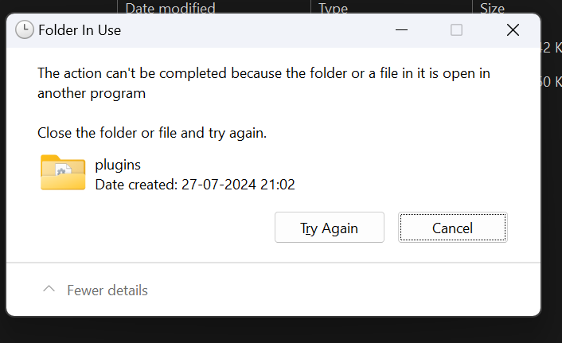

# The Installation Guide

# Installation

Here are some Guides for Installing TOR-W Builds. Find out how to install TOR-W on specific launchers, and also how to install various builds.

Other general help related pages can be found at [FAQ](/faq.html) (For common questions).

## Distribution Policy

Dev/Beta Builds are not for distribution. If you are found to be distributing these builds, you will be removed from the respective role and your access to the builds will be revoked.  
If you are a content creator, you may use these builds in your videos, but you may not provide a download link for your viewers. If you are found to be distributing these builds, you will be removed from the respective role and your access to the builds will be revoked.  
This policy is in place to keep the integrity of our Tester roles. If you are interested in becoming one, please see the below sections for more information. 

## Town Of Re-Worked (TOR-W)
 

<b>How to get Stable Builds</b>

* Visit `#mod-release` in TOR-W's <a href="https://discord.gg/HczqtuBfcu" style="color:purple">Discord Server</a>, or go <a href="https://github.com/andries659/Town-Of-Re-Worked/releases/latest" style="color:blue">here</a> to download it directly from GitHub. 

Installation requires that you own a PC version of Among Us on Steam, Epic, Xbox App, or Itch. Microsoft Store will not work.

 

<b>Install TOR-W for Steam</b>

Notice: You can follow the installation video [HERE](https://www.youtube.com/watch?v=2oyD75caFQ0) if you want visuals with steps. However, the below steps work just fine.

1. Download the latest full Release of TOR-W in `#mod-release` or <a href="https://github.com/andries659/Town-Of-Re-Worked/releases/latest" style="color:blue">here</a>. You only need the main zip such as "`TOR-W.v1.0.0.zip`", not the source code files. DO NOT DOWNLOAD THE `-MS` FILE, IT WILL NOT WORK!

2. Once the download is complete, unzip it into a new empty folder like on desktop.

3. Locate your AmongUs install. For example, if you own the game on Steam, you can find this by right clicking on the game in your library, selecting "Manage", and finally selecting "Browse local files." 

4. Select all of the files in your Among Us installation and copy them to the folder that now has the files from the TOHE release. The folder should now look something like this: 

5. Within the TOHE folder, run `Among Us.exe`. The first time running it may take some time while the mod sets up its files. If you see a black screen, just wait a couple minutes. Once it finishes loading, you should get a popup with TOHE news. If you do not see anything about TOHE, double check that your files are all in the same folder. 
Note: If you separated your TOR-W Mod and Vanilla folders, and run into an issue where it says 'you are logged out/in offline mode', close TOHE and open Steam (or launch Vanilla AU as this will open Steam too), then try again. This should solve the issue. (Separating your folders isn't required, but recommended so your mod still works if a major Among Us update is released.)

6. `(Optional)` Right click your `Among Us.exe` and click '`Create shortcut`'. Move your new shortcut to wherever you can easily access it, such as your Desktop!
#### You have now installed TOR-W! All that remains is to start up a private lobby and customize your settings.

> From: NotPyro404

 

<b>Install TOR-W for Epic Games</b>

Notice: You can follow the installation video [HERE](https://www.youtube.com/watch?v=2oyD75caFQ0) if you want visuals with steps. However, the below steps work just fine.

1. Download the latest full Release of TOR-W in `#mod-release` or <a href="https://github.com/andries659/Town-Of-Re-Worked/releases/latest" style="color:blue">here</a>. You only need the main zip such as "`TOR-W.v1.0.0.zip`", not the source code files.

2. Once the download is complete, unzip it into a new empty folder somewhere like on desktop.

3. Locate your AmongUs install. Find Among Us and click on the 3 dots `...` > click the folder icon button on the installation bar. 

4. Select all of the files in your TOHE folder and copy them to the Among Us installation folder. The folder should now look something like this: 

5. Within the Among Us folder, run `EpicGamesStarter.exe` ([Download Here](https://github.com/whichtwix/EpicGamesStarter/releases/tag/1.0.2) & Follow instructions on page.) The first time running it may take some time while installing a prerequisite and the mod sets up its files. If you see a black screen or a console window, just wait a couple minutes. Once it finishes loading, you should get a popup with TOR-W news. If you do not see anything about TOR-W, double check that your files are all in the same folder. 
Note: Unlike Steam, you shouldn't run into the 'you are logged out/in offline mode' issue as TOHE has to be in your Epic Games folder and cannot be separated. You can play Vanilla as usual by clicking the Settings Wheel in the top-right of the window, and swapping to Vanilla.

6. Add the folder you put the mod and among us files in as a exclusion for any antivirus you have and windows defender.

7. `(Optional)` Right click your `EpicGamesStarter.exe` and click '`Create shortcut`'. Move your new shortcut to wherever you can easily access it, such as your Desktop!

#### You have now installed Town of Host: Optimized Continued! All that remains is to start up a private lobby and customize your settings.

> From: Twix

 

<b>How to get Dev Builds</b>

* Visit `#test-builds` in TOR-W's <a href="https://discord.gg/HczqtuBfcu" style="color:purple">Discord Server</a>, and download the latest dll!

 

<b>Installing Dev Builds</b>

1. Download the latest dll in `#test-builds`.

2. Make sure you don't have your Modded Client open when you attempt to do this, please close TOHE beforehand, otherwise you will get a pop-up which looks something like this: 

3. Once the download is complete, move the dll into your `TOHE\BepInEx\plugins` folder. (TOHE will be whatever your Mod Folder is, if you renamed it, it will be that one)

4. Within the TOHE folder, run Among Us like you usually would. Once it finishes loading, you should get a popup with TOHE news. If you do not see anything about TOHE, double check that your files are all in the same folder, & that you launched from your modded folder.

#### You have successfully installed a Dev Build!

## Modding Us
 

<b>How to get Stable Builds</b>

* Visit the <a href="https://discord.gg/S6hY6DaJBQ" style="color:lime">Modding Us Discord Server</a> and go to the `📣download` channel and look for the latest APK link **OR** visit the <a href="github.com/OvernightAU/ModdingUs/releases/latest" style="color:lime">Modding Us Releases</a> for the latest APK.

 

<b>Installing Beta Builds</b>

* Visit the <a href="https://discord.gg/S6hY6DaJBQ" style="color:lime">Modding Us Discord Server</a> and go to the `📣announcements` channel, and sign up for the Beta testing programme. 
After that, you'll be granted the `@Beta Tester` role, ans will have access to the beta downloads channel.

